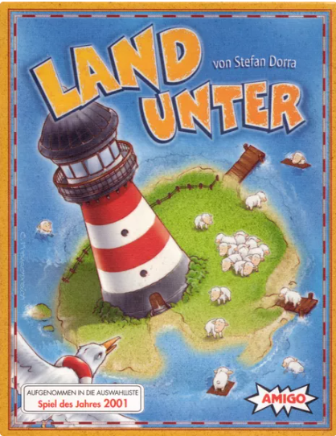
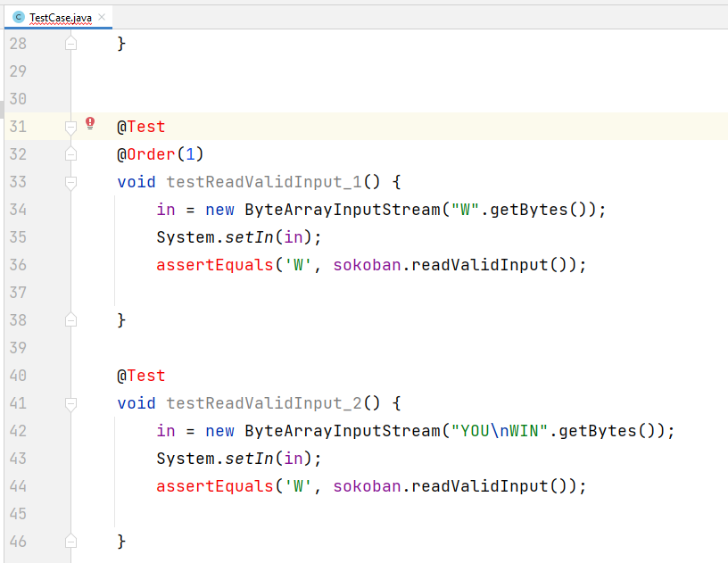
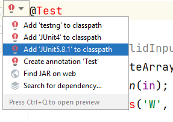

# COMP2026/COMP2045 Programming Assignment 2 - Land Unter (Turn the Tide)

## 2023-24 Semester 1

* Designed by: [Dr. Kevin Wang](mailto:kevinw@comp.hkbu.edu.hk)
* Q & A: [Discord](https://discordapp.com/channels/1004554070083776672/1004554070083776678)
* Assignment Website: [GitHub](https://github.com/khwang0/COMP2045-2324PA2)
* Due: 
  * UAT Due: 23:59pm TBD (Monday midnight)
  * Programming Due: 23:59pm TBD (Thursday midnight)
* Download the demo program: [here](demo.jar)
* Download everything from the assignment: [here](https://github.com/khwang0/COMP2045-2324PA2/archive/refs/heads/master.zip)
* Partnering rule: In this assignment, you are allowed to partner with another student to complete the coding part of the assignment with the following rules apply:
  * The student you have partnered must also be taking COMP2026/COMP2045 in this semester. 
  * Each student may partner with at most one other student.
  * Students who are in partner should work together physically at lab with our lab machines for most of the time. You need to report the date/time/location of your working session. We may audit that with our machine login time when necessary.
  * Maximum score of the assignment is 100. If you partner with another student, the maximum score will be 90.
  * For students retaking this course, partnering with another student is highly encouraged and your maximum score will not be capped.
  * **UAT is an individual task**. You should not discuss with your partner about the UAT before the UAT due.
  * If you think you are one of the top students, simply ignore about this partnering rule.
 

> To run the demo program, type the following in your terminal:
> 
> ```sh
> > java -jar demo.jar
> ```



<sub><sup>

image ref: https://boardgamegeek.com/image/725351/turn-tide

</sup></sub>

# Learning outcome

Students are expected to have some practice on object oriented concepts as well as some further practice on basic java syntax in this assignment. We expect most students would spend eight hours or more to finish the assignment without any assistance. Make sure you start earlier as possible and ask us on Discord if you have any difficulty! Note: again you are not supposed (and not allowed) to use advanced data structures like ArrayList, Set, Map, etc. Also, you are not allowed to add, any class, any class attribute/field, and any public method in this assignment. However, you can add your own private method if you want to.


# Introduction

Land Unter is one of my favorite board game. We will demo the game in the lecture. You can also watch the following video to understand the rule of the game.

- [PDF version - our offical rules when there is discrepancy](Turn_the_Tide_Rules.pdf)
- [English version](https://www.youtube.com/watch?v=5Z5o7z7Qq3w)
- [Chinese version](https://www.youtube.com/watch?v=RmATWF_rAx4)


## Explanation about the assignment

You are given the skeleton code. Complete all methods in the assignment with respect to the instructions stated in the Java file.
There are some methods you are not allowed to touch. You should only work on the methods that says `TODO`. You are not allowed to add any class, any class attribute/field, and any public method in this assignment. However, you can add your own private method if you want to.

* **Shuffle tide cards**. Tide cards should be shuffled exactly once before each turn. It should be done via the method `shuffleTideCards`, which has been implemented for you. You should not modify this method. Therefore, the order of the tide cards should be different in each round. During grading we may change the `shuffleTideCards` method to test your code. Do not hard code tide card in your code.
* **Shuffle weather cards**. In the first round, Player 1 (human player) should hold the card `31, 26, 54, 19, 8, 45, 39, 16, 28, 42, 3, 38`, player 2 (AI-1) should hold the card `30, 60, 58, 56, 51, 10, 41, 48, 14, 9, 32, 44`, etc where those order are pre-defined in the array `MAGIC_NUMBERS`. In the second round, Player 1 should take AI-1's hand, AI-1 should take AI-2's hand where the last player should take Player 1's hand. You should use the 2D array `decks` to store the original weather card. During grading, we may change the array `MAGIC_NUMBERS`. Do not hard code the weather card order in your code.
* **Print hand**. As refered to the demo, only human player's hand will be printed. 


## `TestClass` class

You don't need to do anything with this java file. The purpose of this file is to conduct some *unit test* for your code. If you are using IntelliJ, you should be able to use this file within a few quick steps. By looking at this file, you should have some ideas of how the TA grade your work!

1. Open the file `TestClass.java`
2. Click on the word `@Test` at line 31.
 
3. Click the red bulb and select `Add JUnit-5.x.x to classpath`.
   
4. Click the arrow on the left of `public class TestClass` at line 17 and select `Run Tests`.

1. You shall see the following screen if there isn't any problem
  
1. Or you will see some error if your code does not perform what it is suppose to do. For example in the figure below, the test case `testReadValidInput` is not working properly.
 

> Note: If you are struggle with this file (e.g. cannot compile your code), simply delete this file. 

# Understanding the Assignment Test (UAT)

This part is independent to your programming code. You will need to answer the following short questions by **another due date**.
Submit your answers on Moodle. 

1. If I starts with the following hand, how many life preservers will I get at the beginning of the round? 
    ```
    2, 40, 28, 42, 3, 38, 54, 19, 8, 45, 39, 16
    ```
2. If there are four players playing the game, how many players will receive a tide card after playing for one turn?
3. Can one player take two tide card in one turn?
4. Which method in `Table` class is corresponding to dealing weather card to players?
5. Which class variable/attribute of `Player` class is used to store the player's current tide level?

---


# Submission 
For submission upload the file `Table.java`, `Player.java`, `Weather.java` to GitHub classroom.  

Please be reminded that both the **Late Penalty Rule** and the **Penalty for Plagiarism** are applied strictly to all submissions of this course (including this assignment).   

### Late Penalty Rule

```java
if (lateHour > 0) {
    if (lateHour < 24) 
        mark *= 0.8;
    else if (lateHour < 48)
        mark = mark >> 1;
        else if (lateHour < 72)
            mark = mark >> 2;
            else
                mark &= 0;
}
```


 ## Plagiarism

 Plagiarism is a serious offense and can be easily detected. Please don't share your code to your classmate even if they are threatening you with your friendship. If they don't have the ability to work on something that can compile, they would not be able to change your code to a state that we can't detect the act of plagiarism. For the first commit of plagiarism, regardless you shared your code or copied code from others, you will receive 0 with an addition of 5-mark penalty. If you commit plagiarism twice, your case will be presented in the exam board and you will receive a F directly.


> # Terms about generative AI
> You are not allowed to use any generative AI in this assignment.
> The reason is straight forward. If you use generative AI, you are
> unable to practice your coding skills. We would like you to get
> familiar with the syntax and the logic of the Java programming.
> We will examine your code using detection software as well as 
> inspecting your code with our eyes. Using generative AI tool 
> may fail your assignment.

## Marking Scheme 
This assignment is worth X% of the course mark.  There are three elements in the marking scheme: 
* 5% - Understanding the Assignment Test (UAT)
* 10% - the program can be compiled without any error
* 75% - a working program that functions as specified 
* 10% - completion of the `runApp` method.
* -50% - if you define any class variable (field), addition class, or change the method `main`.
* -30% - if you use any advanced data structure such as `java.util.List`, `java.util.ArrayList`, `java.util.Arrays`, `java.util.Set`, `java.util.Map` etc to replace your primitive array.

Please note that submitting a program that cannot be compiled would result in a very low mark. 

For the correctness of your program, we will test your program with a set of test cases.  The test cases will be similar to the sample program.  All test cases will be released after the submission deadline.  
 

## Interview 
Should the teaching team see fit, students may be requested to attend an interview to explain about their program.  Students failing to attend such interview or to demonstrate a good understanding of their own program may result in mark deduction. 


